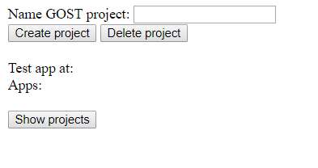

# Getting started with play-with-gost

```
$ docker --version
Docker version 17.09.0-ce, build afdb6d4
$ dotnet --version
2.0.2
$ docker-compose --version
docker-compose version 1.16.1, build 6d1ac219
```

Step 1: Start proxy

```
$ docker run -d -p 80:80 --name nginx-proxy -v /var/run/docker.sock:/tmp/docker.sock:ro jwilder/nginx-proxy
```

Step 2: Create GOST network

```
$ docker network create gost-network
```

Step 3: Join nginx proxy and gost-network

```
$ docker network connect gost-network nginx-proxy
```

Step 4: Run pwg application

```
$ git clone https://github.com/gost/play-with-gost.git
$ cd play-with-gost/app/pwg.web1.1
$ dotnet restore
$ dotnet run
Using launch settings from D:\dev\github.com\gost\play-with-gost\app\pwg.web1.1\Properties\launchSettings.json...
Hosting environment: Development
Content root path: D:\dev\github.com\gost\play-with-gost\app\pwg.web1.1
Now listening on: http://localhost:50118
Application started. Press Ctrl+C to shut down.
```

Now open http://localhost:50118/index.html



Step 5: Create new GOST project

- Enter a name for new GOST project (for example: test)

- Click 'Create project' button

- Wait some time (minutes) to create the new instance. 

- Check with container creation with command line. Wait until there are 4 running containers (3 for GOST + 1 for proxy):

```
$ docker ps

CONTAINER ID        IMAGE                  COMMAND                  CREATED              STATUS              PORTS                     NAMES
d5a4109e956b        geodan/gost            "/bin/sh -c ./gost"      22 seconds ago       Up 3 seconds        8080/tcp                  test_gost_1
f0f38f637227        bertt/gost-dashboard   "nginx -g 'daemon off"   About a minute ago   Up 39 seconds       127.0.0.1:32768->80/tcp   test_dashboard_1
b11a329e4aef        geodan/gost-db         "docker-entrypoint.sh"   About a minute ago   Up 41 seconds       5432/tcp                  test_gost-db_1
31a5665570c6        jwilder/nginx-proxy    "/app/docker-entrypoi"   18 minutes ago       Up 18 minutes       0.0.0.0:80->80/tcp        nginx-proxy
```

- Check with website container creation: press 'Show projects' button, should show 1 new project 'test'

- When started, go to your new GOST instance: http://test.lvh.me (in case of test as projectname)

Step 6: Delete GOST project

- Enter a name for existing GOST project (for example: test)

- Press 'Delete project' button

- Wait some time (minutes) to delete the new instance. 

- Check with container deletion with command line

Wait until there is 1 running container (the proxy):

```
$ docker ps
CONTAINER ID        IMAGE                 COMMAND                  CREATED             STATUS              PORTS                NAMES
31a5665570c6        jwilder/nginx-proxy   "/app/docker-entrypoi"   20 minutes ago      Up 20 minutes       0.0.0.0:80->80/tcp   nginx-proxy
```

- Check with website container deletion: press 'Show projects' button, shopuld now show '[]'

